# e-Commerce-Medical-Store
Med-Deli is a normal health care product ordering system which implements the MVC (Model-View-Control) Architecture.
As View, Angular-11 with routing is used. For the backend, Spring Boot is used. For the Database Support, MySql has been used. Java Persistence Api (JPA) is used to write the Business Logic. REST Api's are written to communicate between server ports (Angular-> port:4200, SpringBoot -> port:8282, MySql -> port:3306)

The project consist of a role based Login and Register page when user navigates to localhost:4200. On successfull login or Registration as a user, a page with all the list of available products will open. This page would have category list and brand list to fetch products as per category or as per brand.
Also, one can navigate to particular product detail page and shows the available quantity of the product. When items are added to cart and click the cart button which lists all the added products in the cart with the added quantity number and total amount of all the added products, having increase, decrease or delete the product option also. After checking all the added product details and navigated to payment page, it asks for personal and card details. On clicking the checkout option, the products get purchased and again lists the product available in the database.

Similarly, when a person logins or registers as an admin, a page with the admin functionalites appers with an option to alter, delete, add the product details. If an admin adds the product details a post request is made and the DB updates itself. The component refreshes itself and the page doesn't need to refresh to see the changes.

### Features
1. Register or login:
    - as user
    - as admin
    
##### As User
1. Filter the product list:
    - Category based
    - Brand based
2. Add to cart
3. Navigate to product detail page
    - Add to cart
    - back to home page
4. Cart status
    - cart details
    - delete product
    - increase quantity of product
    - decrease quantity of product
    - continue button
5. Payment page
    - checkout button
6. Back to home button
7. Logout

##### As Admin
1. View product lis
2. Update product
3. Delete product
4. View product detail
5. Add product
6. Add brand
7. Delete brand
8. Add category
9. Delete category
10. Logout

## Pre-Requisite
1. Java 7 or Above installed on device
2. MySQL Server
3. NodeJS - npm
4. Clone the project

##### Configure MySQL
Create a database in your MySQL instance.
Update the application.properties file in the src/main/resources folder with the URL, username and password for your MySQL instance. The table schema for the health care product will be created for you in the database.

##### For backend
1. mvn clean install spring-boot:run
2. Spring server would be running on http://localhost:8282

##### For frontend
1. cd angulartodomanagementapp
2. In CLI write npm install
3. In CLI write npm start
4. App is running on port 4200
5. Run frontend on: http://localhost:4200/

### Project sneak peek

<table>
  <tr>
     <td>Registeration page for admin and login></td>
     <td>Successful login</td>
  </tr>
  <tr>
    <td>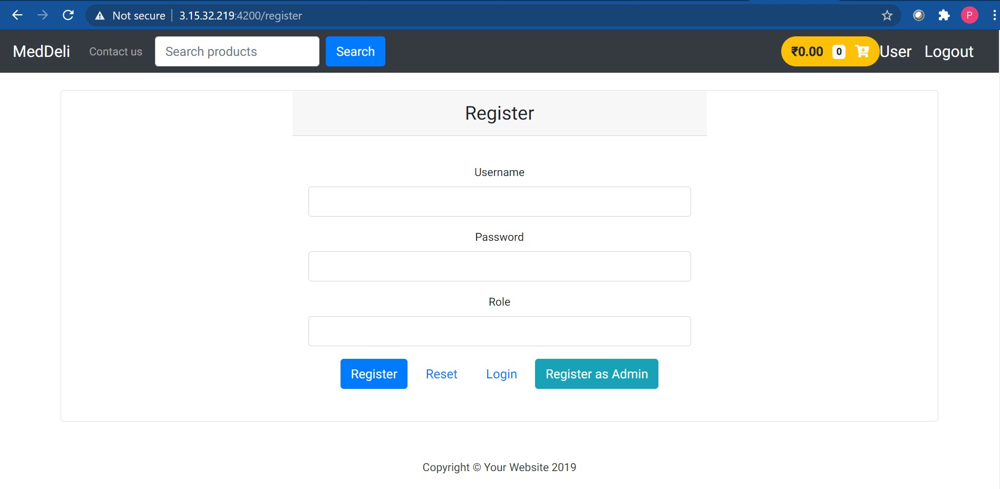</td>
    <td>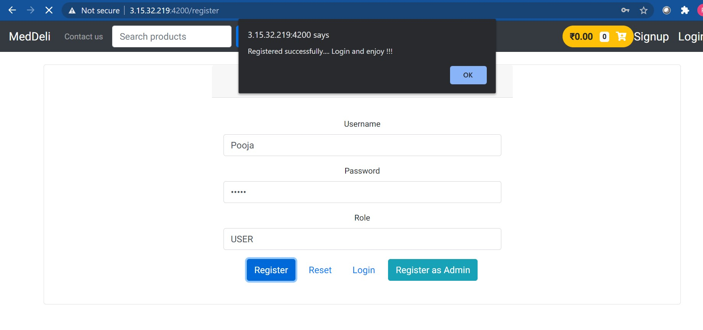</td>
  </tr>
 </table>
 
 <table>
  <tr>
     <td>Front page</td>
     <td>Product list as per brand filter</td>
  </tr>
  <tr>
    <td>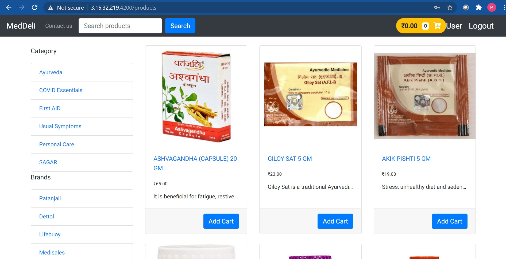</td>
    <td>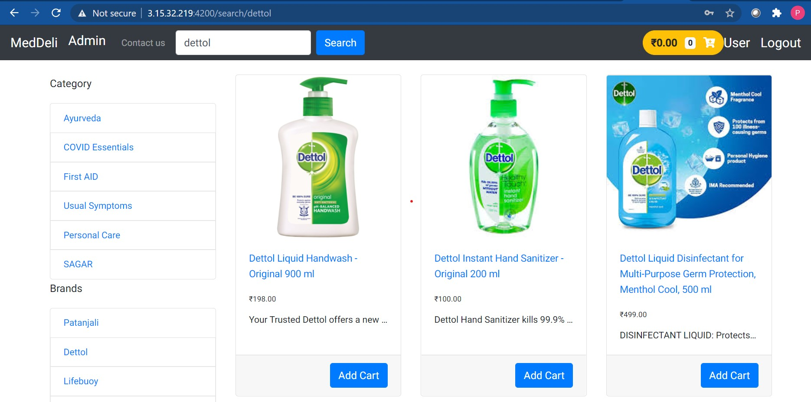</td>
  </tr>
 </table>
 
 <table>
  <tr>
     <td>Particular product detail</td>
     <td>Cart details</td>
  </tr>
  <tr>
    <td>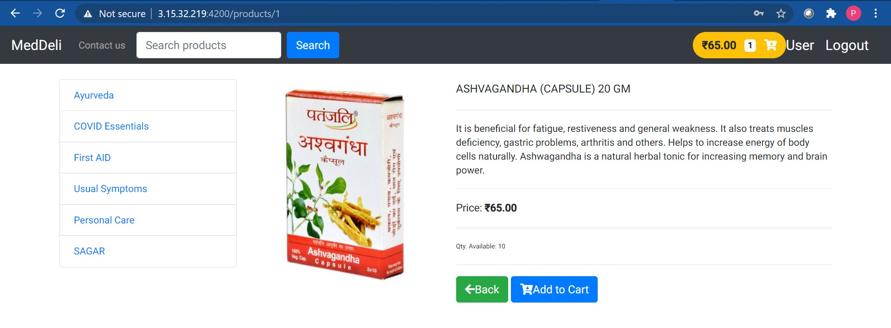</td>
    <td>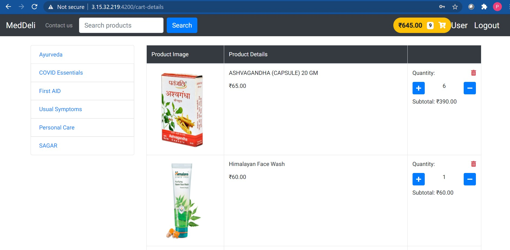</td>
  </tr>
 </table>
 
 <table>
  <tr>
     <td>Payment page</td>
     <td>Successful checkout</td>
  </tr>
  <tr>
    <td>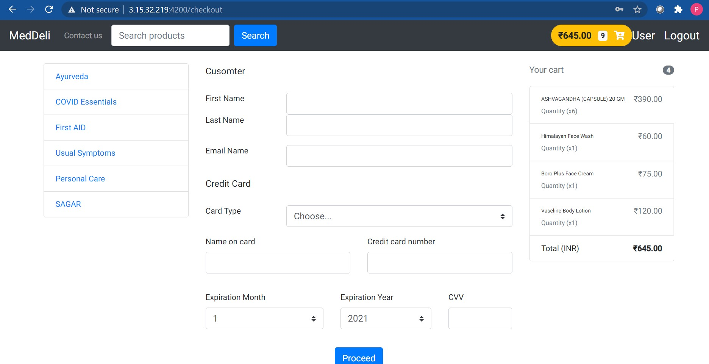</td>
    <td>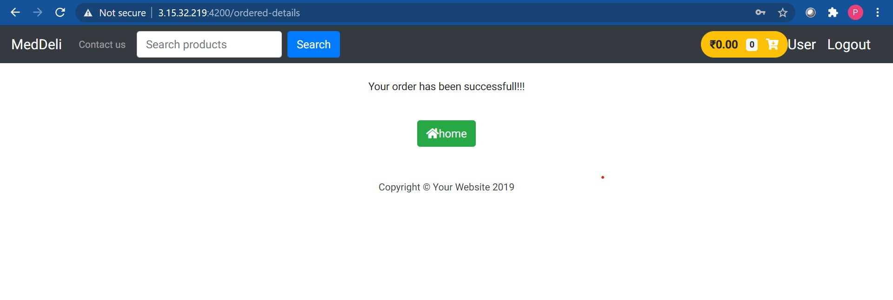</td>
  </tr>
 </table>
 
 <table>
  <tr>
     <td>Admin product list</td>
     <td>Admin category list</td>
  </tr>
  <tr>
    <td>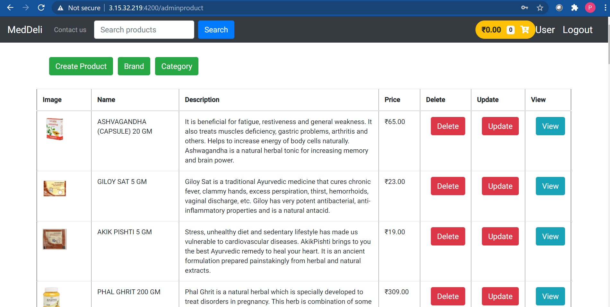</td>
    <td>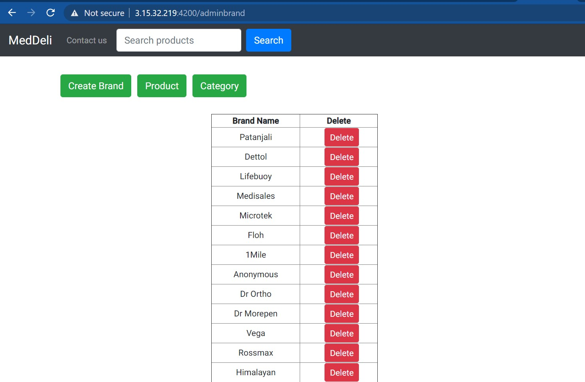</td>
  </tr>
 </table>
 
 <table>
  <tr>
     <td>Admin brand list</td>
  </tr>
  <tr>
    <td>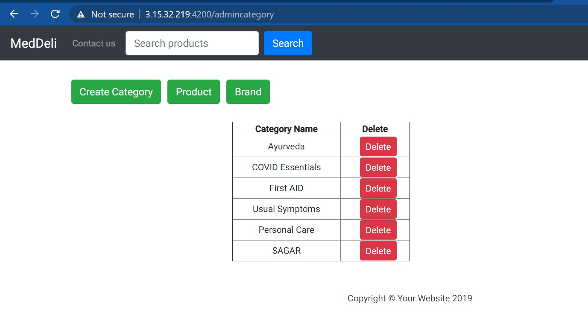</td>
  </tr>
 </table>
